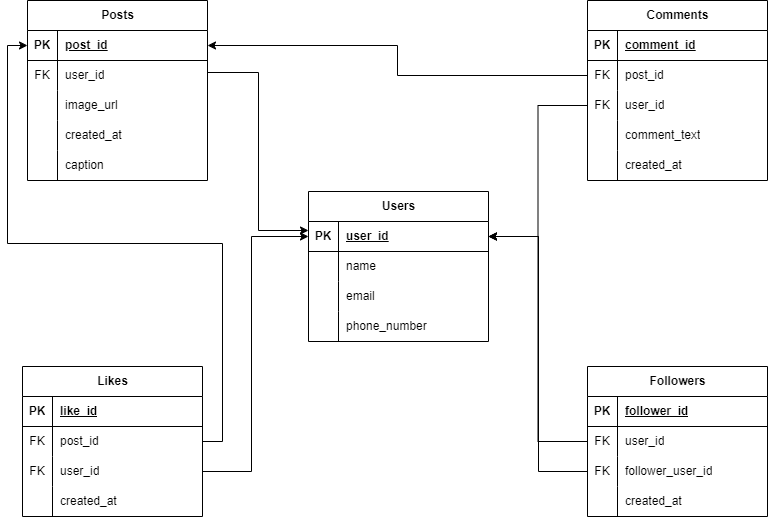

# Instagram Data Analytics Project

## Overview

This project focuses on modeling and analyzing Instagram-like data using SQL. It covers the creation, management, and querying of key database tables such as Users, Posts, Comments, Likes, and Followers. The repository is designed to provide insights into user behavior, post engagement, and overall account interactions through SQL-based operations.

## Data Model

### Key Components

1. **Database Schema (DDL)**:  
   The project defines the structure of the database tables using Data Definition Language (DDL). The primary tables include:
   - **Users**: Stores user details like name, email, and phone number.
   - **Posts**: Captures posts made by users with captions and image URLs.
   - **Comments**: Stores comments on posts, linking them with users.
   - **Likes**: Tracks likes on posts, allowing engagement analysis.
   - **Followers**: Records follower relationships between users.

2. **Data Insertion (DML)**:  
   The Data Manipulation Language (DML) script populates these tables with sample data, representing typical social media interactions:
   - Example users, posts, comments, likes, and followers are inserted to simulate a real environment.

3. **Data Analysis Queries**:  
   The project includes several SQL queries for analyzing the data. These queries are designed to:
   - Track post engagement by counting likes and comments.
   - Rank posts based on the number of likes.
   - Identify active users by analyzing their comments and interactions.
   - Categorize posts based on engagement levels.
   - Display follower growth and user interactions.

### Use Cases

- **Content Analysis**: Understand which posts perform better based on likes and comments.
- **User Behavior**: Analyze user engagement by tracking comment and like activity.
- **Follower Dynamics**: Study follower relationships and interactions between users.

### Getting Started

1. **Set Up Database**: Use the DDL script to create the database schema.
2. **Populate Data**: Run the DML script to insert sample data into the tables.
3. **Perform Analysis**: Execute the provided SQL queries to analyze the data and generate insights.

# Please Note all the analysis is done on the sample data which can be found in dml.sql
